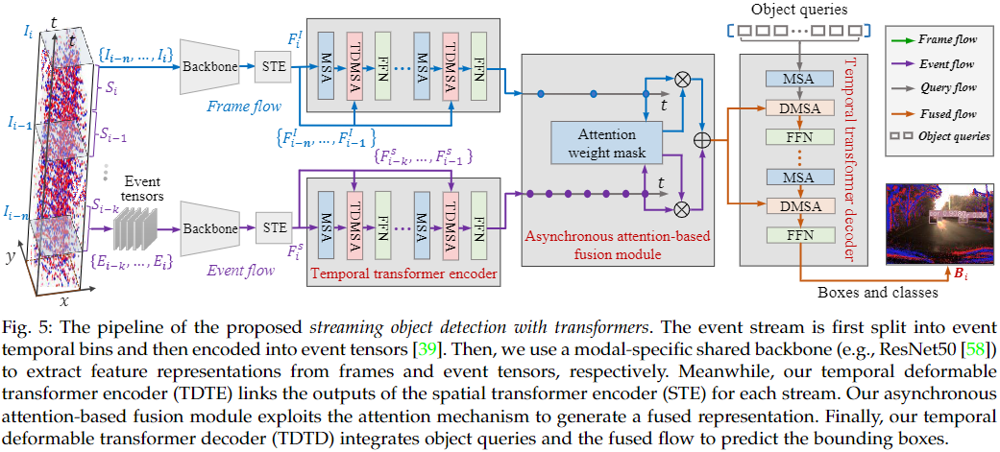

# SODFormer: Streaming Object Detection with Transformers Using Events and Frames
This is the official implementation of **SODFormer**, a novel multimodal streaming object detector with transformers. For more details, please refer to:

**SODFormer: Streaming Object Detection with Transformers Using Events and Frames**  
Dianze Li, Jianing Li, and Yonghong Tian, Fellow, IEEE


## Setup
This code has been tested with Python 3.9, Pytorch 1.7, CUDA 10.1 and cuDNN 7.6.3 on Ubuntu 16.04.
* Clone the repository  
```
git clone --depth=1 https://github.com/dianzl/SODFormer.git && cd SODFormer
```
* Setup python environment

  We recommend you to use Anaconda to create a conda environment:
```
conda create -n sodformer python=3.9 pip
source activate sodformer
```
* Install pytorch
```
conda install pytorch==1.7.1 torchvision==0.8.2 torchaudio==0.7.2 cudatoolkit=10.1 -c pytorch
```
* Other requirements
```
pip install -r requirements.txt
```
* Compiling CUDA operators
```
cd ./models/ops
sh ./make.sh
# unit test (should see all checking is True)
python test.py
```
## Data preparation
Please download [PKU-DAVIS-SOD Dataset](https://git.openi.org.cn/LiDianze/PKU-DAVIS-SOD) and organize them as follows:
```
code_root/
└── data/
    ├── raw/
        ├── train/
        ├── val/
        ├── test/
            ├── normal/
                └── 001_test_normal.aedat4
            ├── low_light/
            └── motion_blur/
    └── annotations/
        ├── train/
        ├── val/
        └── test/
```
For the purpose of saving memory and accelerate data reading, we first convert the raw .aedat4 files to synrhronous frames (.png) and events (.npy) as follows:
```
python ./data/davis346_temporal_event_to_npy.py
python ./data/davis346_to_images.py
```
After running this two files, the data should be automatically organized as:
```
code_root/
└── data/
    ├── aps_frames/
        ├── train/
        ├── val/
        ├── test/
            ├── normal/
                └── 001_test_normal
                    └── 0.png
            ├── low_light/
            └── motion_blur/
    └── events_npys/
        ├── train/
        ├── val/
        └── test/
            ├── normal/
                └── 001_test_normal
                    └── 0.npy
            ├── low_light/
            └── motion_blur/
```
## Usage
### Training
#### Training on single node with single GPU
You can simply run 
```
./configs/sodformer.sh
```
to train a model with our default parameters. The meaning of each parameter can be found in [param.txt](./configs/param.txt).
#### Training on single node with multi-GPUs
Our code also implements multi-GPUs training on single node. For example, the command for training SODFormer on 2 GPUs is as follows:
```
GPUS_PER_NODE=2 ./tools/run_dist_launch.sh 2 ./configs/sodformer.sh
```
#### Some tips to speed-up training
* You may increase the batch size to maximize the GPU utilization, according to GPU memory of yours, e.g., set '--batch_size 4' or '--batch_size 8'.
* Some computation involving [MultiScaleDeformableAttention](https://arxiv.org/abs/2010.04159) can be accelerated by setting batch size to integer power of 2 (e.g., 4, 8, etc.).
### Evaluation
You can get the pretrained models of SODFormer (the link is in "Quantitative results" session), then run following command to evaluate it on PKU-DAVIS-SOD test dataset:
```
.configs/sodformer.sh --resume <path to pre-trained model> --eval
```
You can also run distributed evaluation by using
```
GPUS_PER_NODE=2 ./tools/run_dist_launch.sh 2 ./configs/sodformer.sh --resume <path to pre-trained model> --eval
```
### Asynchronous prediction
Our code supports prediction of asynchronous streams of frame and event of one video. Similarly, we first generate asynchronous frames (.png) and events (.npy) from raw .aedat4 files (with 001_test_normal.aedat4 as instance):
```
python ./data/asyn_event_npy.py --scene normal --filename 001_test_normal.aedat4
```
After running the above command, the asynchronous data of 001_test_normal.aedat4 should be automatically organized as:
```
code_root/
└── data/
    └── asyn/
        ├── events_npys/
            └── test/
                └── normal/
                    └── 001_test_normal
                        └── 0.npy
        └── davis_images/
            └── test/
                └── normal/
                    └── 001_test_normal
                        └── 0.png
```
The asynchronous prediction and visualization can be done as follows:
```
./configs/prediction.sh --resume <path to pre-trained model> --scene normal --datasetname 1 --vis_dir <path to save prediction images>
```
## Main results
### Quantitative results

| Modality | Method | Temporal cues | Input representation | AP$\_{50}$ | Runtime (ms) | URL |
|:--------:|:------:|:-------------:|:--------------------:|:-----------:|:------------:|:---:|
| Events | [NGA-events](https://link.springer.com/chapter/10.1007/978-3-030-58517-4_6) | N | Voxel grid |  |  | - |
| Events | [LSTM-SSD](https://openaccess.thecvf.com/content_cvpr_2018/html/Liu_Mobile_Video_Object_CVPR_2018_paper.html) | Y | Event image | | | - |
| Events | [Deformable DETR](https://arxiv.org/abs/2010.04159) | N | Event image | 0.305 | 21.6 | entss |
| Events | Spatio-temporal Deformable DETR | Y | Event image | 0.331 | 25.0 | etss |
| Frames | [YOLOv3](https://arxiv.org/abs/1804.02767) | N | RGB frame | 0.426 | 7.9 | - |
| Frames | LSTM-SSD | Y | RGB frame | 0.456 | 22.4 | - |
| Frames | Deformable DETR | N | RGB frame | 0.461 | 21.5 | fntss |
| Frames | Spatio-temporal Deformable DETR | Y | RGB frame | 0.487 | 24.9 | ftss |
| Events + Frames | [MFEPD](https://ieeexplore.ieee.org/abstract/document/8793924/) | N | Event image + RGB frame | 0.438 | 8.2 | - |
| Events + Frames | [JDF](https://ieeexplore.ieee.org/abstract/document/8784777) | N | Channel image + RGB frame | 0.442 | 8.3 | - |
| Events + Frames | SODFormer | Y | Voxel grid + RGB frame | | | - |
| Events + Frames | **SODFormer** | Y | Event image + RGB frame | 0.502 | 39.7 | fusion |

### Demo
[Low light demo](https://github.com/dianzl/SODFormer/blob/master/imgs/motion_blur_demo.gif)

[Motion blur demo](https://github.com/dianzl/SODFormer/blob/master/imgs/low_light_demo.gif)

## Citation

## Related Repos
1. [Deformable DETR: Deformable Transformers for End-to-End Object Detection](https://github.com/fundamentalvision/Deformable-DETR)
2. [TransVOD:End-to-End Video Object Detection with Spatial-Temporal Transformers](https://github.com/SJTU-LuHe/TransVOD)
